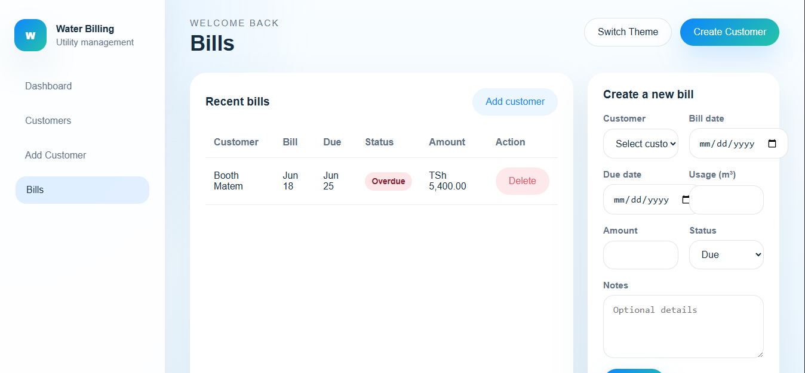

Dashboard

The dashboard serves as the central hub of the Water Billing System, providing a real-time overview of key statistics such as total customers, generated bills, revenue collection, and payment status summaries.

Add Customer

The Add Customer page allows administrators to register new customers by capturing essential information such as customer name, meter number, phone number, and email address.

Customer Management
The Customer Management page displays all registered customers in an organized table, making it easy to view customer information, monitor meter numbers, and manage records efficiently.

Bill Management

The Bill Management page enables users to create, view, and manage customer bills. Administrators can record water usage, assign due dates, track bill amounts, and monitor payment statuses.

 System Highlights
Interactive dashboard with real-time statistics
Easy customer registration and management
Efficient bill creation and tracking
Payment status monitoring (Paid, Due, Overdue)
Responsive and user-friendly interface
Modern design with Dark Mode support
Secure and reliable data handling

The Water Billing System is designed to streamline water utility operations by providing a simple, efficient, and professional platform for managing customers and billing activities.
